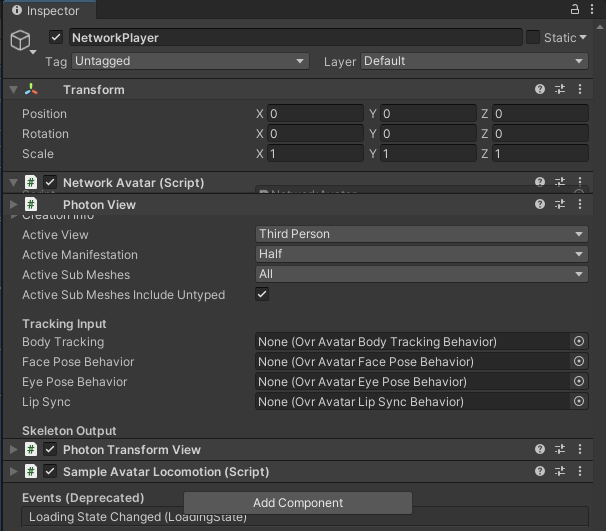

# MultiplayerMetaAvatar

A simple multiplayer Unity project using Meta Avatars (2022) and Photon PUN2

Done in Unity 2020.3.40f1 with Oculus Integration 46.0 and Photon PUN 2 - FREE 2.41 in Windows 11

## How to replicate from scratch, recommended

### 1. Create project and install dependencies

Create a new 3D project in Unity 2020.3.40+

Import Oculus Integration and create an App ID for your app on the Oculus developer dashboard with the adequate
permissions for avatar use (guide [here](https://developer.oculus.com/documentation/unity/meta-avatars-app-config/))

Put the App IDs into the required fields (from the menus -> Oculus/Platform/Edit settings)

Install Photon PUN 2 - Free, create an App in the website and enter the app id when asked

### 1. Scene

Add one of the AvatarSDKManager to the Scene, if no preference, the AvatarSDKManagerHorizon is recommended.

Add the LipSyncInput prefab into the Scene (not needed but recommended for having lip-synced enabled)

Add the Script LogInManager (found in Assets/MyScripts/LogInManager.cs) to the Scene. This script needs:

- spawn point: any gameObject from the scene, it will be the spawn point of the users entering the room.
- Text: a text object where some debug info will be displayed.

Your scene should look something like this

### 2. Player prefab

Create a prefab stored under the Assets/Resources folder named NetworkPlayer.

Add the component NetworkAvatar (which is heavily based on SampleAvatarEntity) to it and change the Active View
parameter to Third View (or the Avatars will be headless)

Add the component Photon View
Add the component Photon Transform View
Add the component Sample Avatar locomotion

The object should look like this

As a child of this first object put an OVRCameraRig object, which will be the view of the headset of the user.

The prefab should then look like this

### 3. Scripts

The scripts required for this project are located in Assets/MyScripts and at this point they should have been added to
your project

- LogInManager: Manages users joining/leaving the app
- NetworkAvatar: Manages changes in the user, like position

### 4. Run

This can only run in the Oculus Quest 2, and you require two headsets with different meta accounts to try it. Otherwise,
since we use the user id, you would only have one user

Have fun!

## How to clone, not recommended

Clone the project, open in the same version of editor, ignore warnings, import Oculus Integration and Photon PUN 2.
Close and reopen the project try to build and run (make sure you are building for the Oculus).

Good luck!